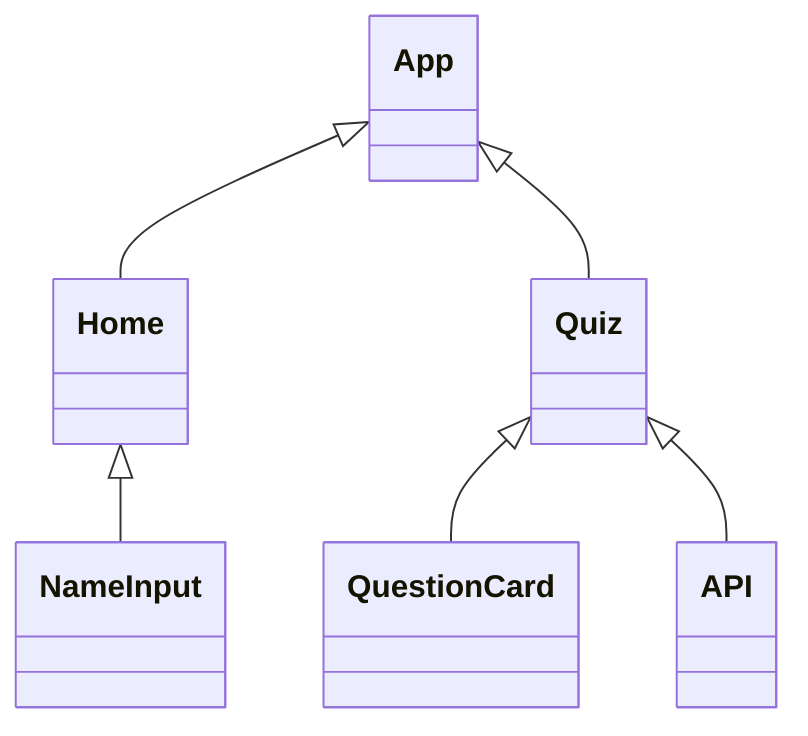

# UML Class Diagram

```mermaid
  classDiagram
    App <|-- Home
    App <|-- Quiz
    Quiz <|-- QuestionCard
    Home <|-- NameInput
    Quiz <|-- API


    class App {

    }

    class Home {

    }

    class Quiz {

    }

    class QuestionCard {

    }

    class NameInput {

    }

    class API {

    }


```
