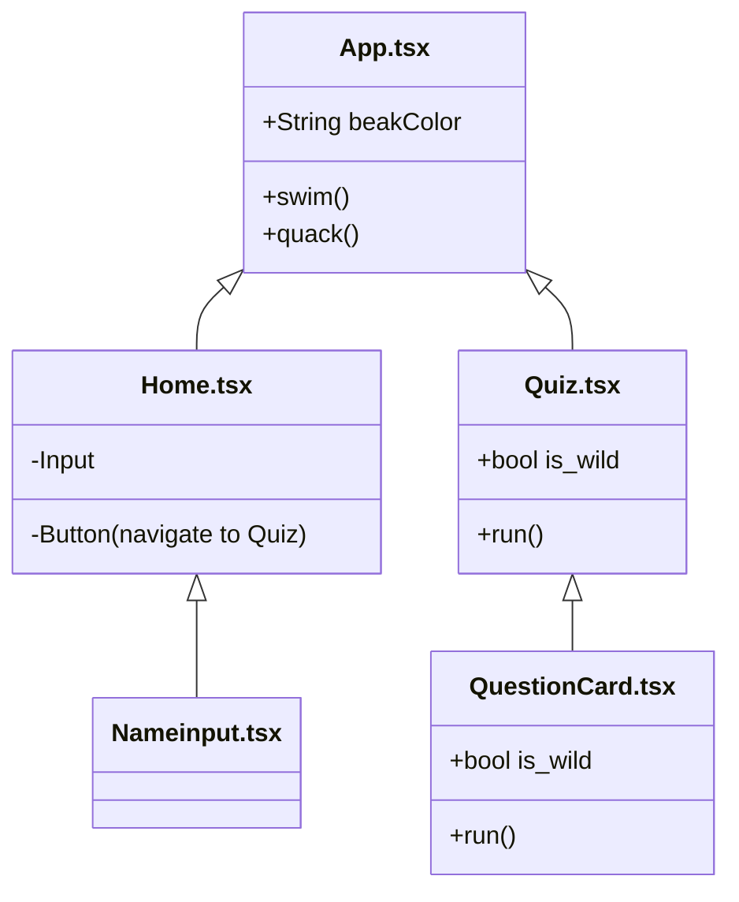

# UML Class Diagram

```mermaid
  classDiagram
    App.tsx <|-- Home.tsx
    App.tsx <|-- Quiz.tsx
    Quiz.tsx <|-- QuestionCard.tsx
    Home.tsx <|-- Nameinput.tsx


    class App.tsx {
        +String beakColor
        +swim()
        +quack()
    }
    class Home.tsx{
        -Input
        -Button(navigate to Quiz)
    }
    class Quiz.tsx{
        +bool is_wild
        +run()
    }
    class QuestionCard.tsx{
        +bool is_wild
        +run()
    }


```
