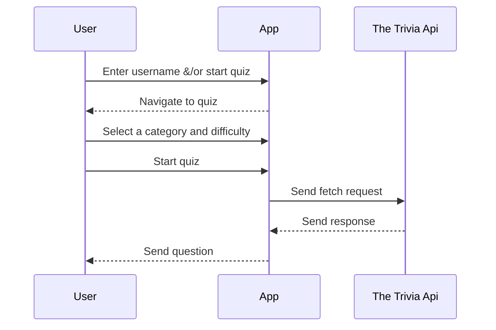

# UML Sequence Diagram

```mermaid
sequenceDiagram
    participant  U as User
    participant A as App
    participant T as The Trivia Api

    U->>A: Enter username &/or start quiz
    A-->>U: Navigate to quiz
    U->>A: Select a category and difficulty
    U->>A: Start quiz
    A->>T: Send fetch request
    T-->>A: Send response
    A-->>U: Send question


```
