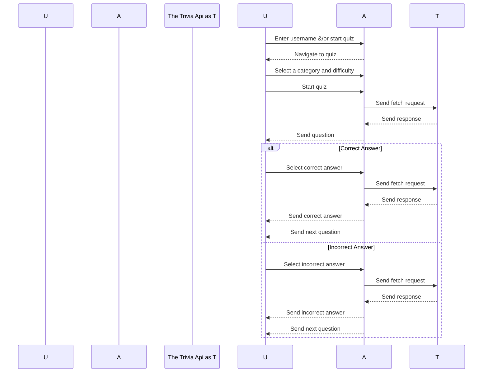

# UML Sequence Diagram

```mermaid
sequenceDiagram
    participant User as U
    participant App as A
    participant The Trivia Api as T

    U->>A: Enter username &/or start quiz
    A-->>U: Navigate to quiz
    U->>A: Select a category and difficulty
    U->>A: Start quiz
    A->>T: Send fetch request
    T-->>A: Send response
    A-->>U: Send question

    alt Correct Answer
        U->>A: Select correct answer
        A->>T: Send fetch request
        T-->>A: Send response
        A-->>U: Send correct answer
        A-->>U: Send next question
    else Incorrect Answer
        U->>A: Select incorrect answer
        A->>T: Send fetch request
        T-->>A: Send response
        A-->>U: Send incorrect answer
        A-->>U: Send next question
    end
```
